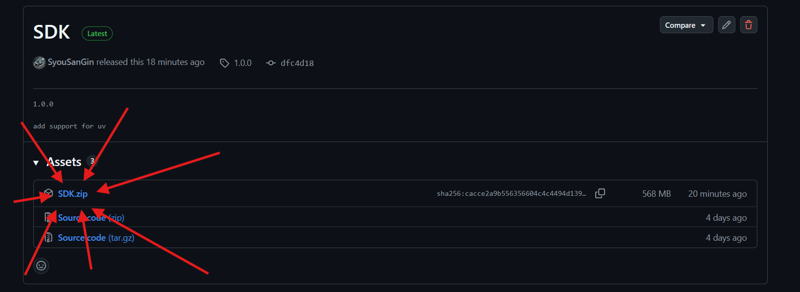
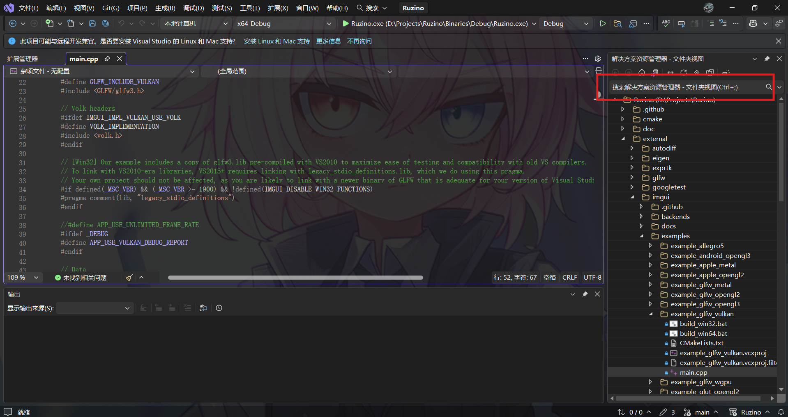
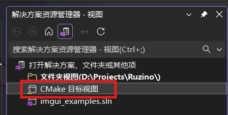
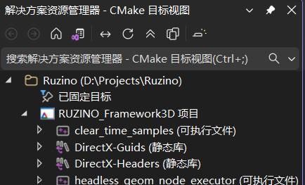
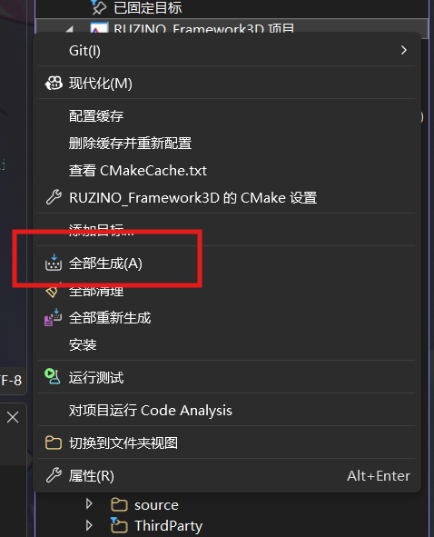
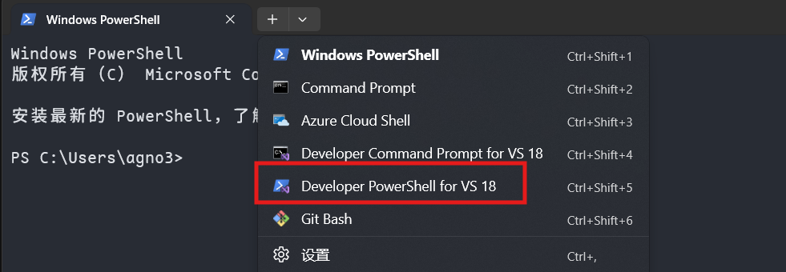
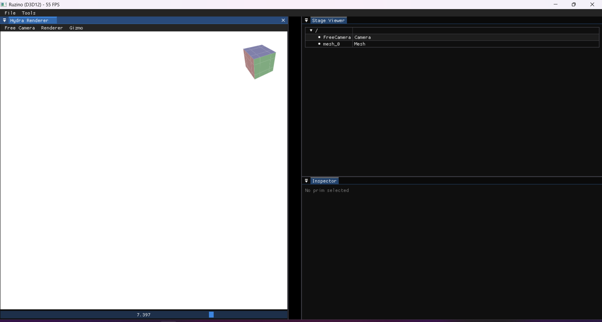
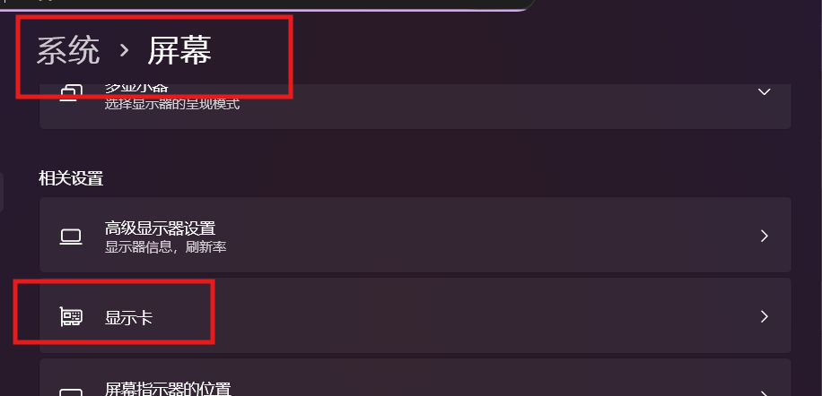
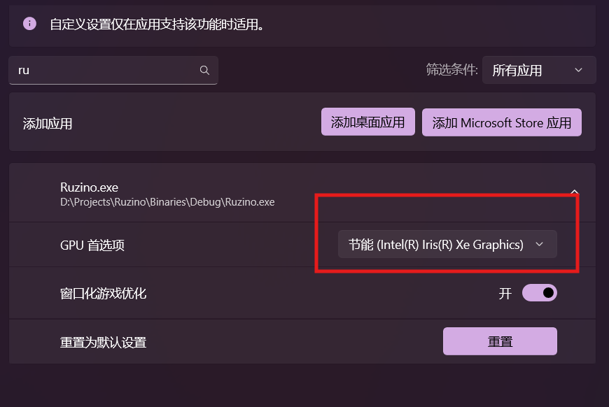

# Ruzino Framework

目前我们提供以下构建指导 

1. Windows + 预构建SDK [->](#method1)
2. 自构建SDK [->](#method2)

如果运行时遇到无法启动的问题，可以参考 [这里](#faq) 或者在仓库里提issue

<a id="method1"></a>

## Windows + 预构建SDK

这是最简单的方法，也是目前兼容性最佳的构建方法，***建议作为首选配置方案***

请大家安装好Visual Studio (推荐2022，可以为2026)，确保Windows版本较新。Python版本无具体限制，别是上古版本就行。建议3.10+


1. 下载SDK：[Release SDK · SyouSanGin/Ruzino-Homework](https://github.com/SyouSanGin/Ruzino-Homework/releases/tag/1.0.0)

2. 将SDK.zip直接丢到3D框架的文件夹下，也就是这个README.md所在的文件夹！

3. cd到3D框架文件夹，执行配置命令。下面分别展示的是Debug & Release的配置命令

```
python .\configure.py --all --build_variant Debug --extract-sdk .\SDK.zip
```

```
python .\configure.py --all --build_variant Release --extract-sdk .\SDK.zip
```

4. 完成上面的配置命令并确认无报错后，开始按照下面的步骤构建

### 使用Visual Studio进行构建

在VS中，**将3D框架的文件夹作为CMake项目进行导入**，等待导入完成后，对项目进行 **全部构建** （不知道什么是全部构建或如何全部构建的，问AI）

以VS2026为例，默认情况下会处于**文件夹视图**



切换到**CMake目标视图**（如果遇到问题，自己上网查询相应操作）




右键RUZINO_Framework3D项目，点击全部生成



如果你是以Debug模式构建，则构建完成后，你可以在Binaries/Debug 下找到 Ruzino.exe。Release构建模式同理。

### 使用终端进行构建

首先，打开**VS配套的开发者终端**，并切换目录到框架目录。不知道什么是开发者终端的，别用这个方法，回去老老实实用Visual Studio！



执行CMake配置命令，并构建

```
mkdir build
cd build
cmake .. -G Ninja
ninja
```

等待构建完成，Ruzino.exe位置同上


<a id="method2"></a>

## 自构建SDK

对于使用Windows以外的系统/~~想要在Windows下折磨自己的同学~~，需要自己构建SDK。需要注意，该部分**我们不确保100%成功**，建议大家使用Windows+预构建SDK

### 温(mian)馨(ze)提(sheng)示(ming)

使用自构建SDK进行配置的同学，请一定要在使用该方案前**确保你有一定的构建知识与自主排查问题的能力**。由于我们无法在各种各样的设备上都进行验证，所以难免配置过程会遇到一些阻碍。请大家**对于出现的问题不要慌张，先仔细阅读报错信息，并充分利用AI工具和各大搜索引擎进行排查**！！！Good luck！！！

### 构建需求

请确保**你的网络一定一定一定一定一定要很很很很很好**！！！构建过程中涉及到从国际链接拉去仓库/下载东西，万一下载不下来，就寄了（你懂的）

- Windows ： Visual Studio 2022，**不可使用其他版本**，亦不可先安装高版本再安装2022的工具链！

- Linux/MacOS: 工具链版本 gcc >= 9 ，具体版本需要自己尝试。需要安装VulkanSDK [Home | Vulkan | Cross platform 3D Graphics](https://www.vulkan.org/) 安装&配置方法网上一抓一大把，根据你自己的系统来

### 构建方法

1. 安装构建依赖。在框架文件夹下，使用pip安装requirements.txt中的包

```shell
pip install -r ./reuqirements.txt
```

2. 运行配置脚本。这一步会进行一些下载和编译操作，请确保网络通畅！

```shell
python .\configure.py --all
```

3. 你需要打包一次SDK.zip，这个过程会复制Python可执行文件，以确保框架在相应功能上的稳定性！

```shell
python .\configure.py --pack
```

4. 将你打包好的SDK.zip剪切到3D框架根目录下，使用预构建SDK的配置方式进行解压（别问为什么，问就是石山代码发力了……）

```
python .\configure.py --all --build_variant Debug --extract-sdk .\SDK.zip
```

5. 使用正常CMake项目构建方式进行构建即可。注意**第一次需要全部构建**！！！

## 运行

如果一切正常，请将工作目录切换到可执行文件坐在目录后启动。运行后界面如下。可能内部窗口排列比较乱，这个无所谓的，拖一拖可以让它吸附然后规整点



<a id="faq"></a>

# FAQ

## Windows下双显卡用户无法启动Ruzino.exe

打开设置，在显示卡设置中指定Ruzino.exe 使用独显/集显即可






